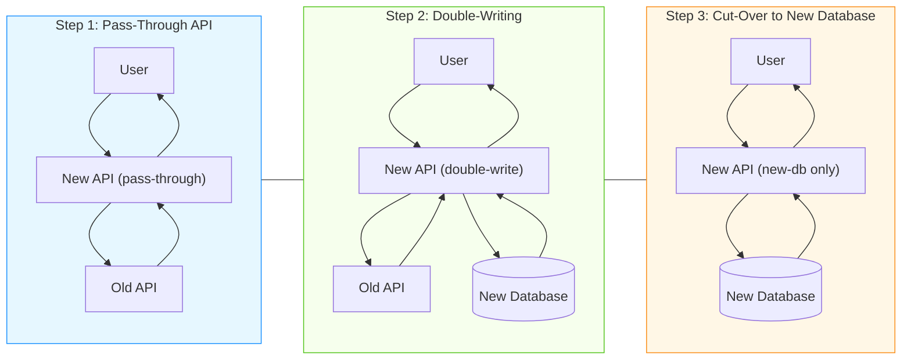

# API Migration Assignment

## What You Will Build

Hello future developers! In this assignment, you will create a new API using Next.js that works with an older API. Think of it like building a bridge between old and new technology.



## Why Are We Doing This?

Imagine you have a toy castle or dollhouse that still works, but you want to add new features to it. Instead of throwing away the old castle or doll house, you build something new that works with it. That's what we're doing with this API!

Companies often need to update their technology without breaking things that already work. This assignment will teach you how to do that.

## The Migration Journey

We are going on a journey to update an old API. This journey has 3 main steps:

### Step 1: Create a Pass-Through API

First, we'll build a "pass-through" API. This is like a messenger that takes requests from users, sends them to the old API, and brings back answers.

```
User → Your New API → Old API → Your New API → User
```

Your new API doesn't change any information - it just passes it along. This way, users can start using your new API without noticing any difference.

### Step 2: Start Using a New Database

Once your pass-through API is working, we'll start saving information in two places:
1. The old API (like we did in Step 1)
2. A new database that you control

```
            → Old API →
User → Your New API           → Your New API → User
            → New Database →
```

This is called "double-writing." It's like making a backup copy of everything.

### Step 3: Say Goodbye to the Old API

Finally, when we're sure the new database has all the information we need, we can stop using the old API for saving information. We'll only use our new database.

```
User → Your New API → New Database → Your New API → User
```

Now your new API is in charge! You can add new features and make improvements without worrying about the old API.

## Your Assignment

For this assignment, you will:

1. Create a new API using Next.js
2. Make it work with the old API (dev.stedi.me)
3. Pass the integration tests in this repository

## What Your API Needs to Do

Your API needs to handle the following requests:

### 1. Create a User
- **Endpoint**: `/user`
- **Method**: POST
- **Body**:
  ```json
  {
    "userName": "email@example.com",
    "email": "email@example.com",
    "phone": "1234567890",
    "region": "US",
    "birthDate": "2000-01-01",
    "password": "Password123",
    "verifyPassword": "Password123",
    "agreedToTermsOfUseDate": 1685923134000,
    "agreedToCookiePolicyDate": 1685923134000,
    "agreedToPrivacyPolicyDate": 1685923134000,
    "agreedToTextMessageDate": 1685923134000
  }
  ```
- **Response**: Status 200 if successful

### 2. Log In
- **Endpoint**: `/login`
- **Method**: POST
- **Body**:
  ```json
  {
    "userName": "email@example.com",
    "password": "Password123"
  }
  ```
- **Response**: Session token as text

### 3. Create a Customer
- **Endpoint**: `/customer`
- **Method**: POST
- **Headers**: `suresteps.session.token: <token from login>`
- **Body**:
  ```json
  {
    "customerName": "Test User",
    "email": "email@example.com",
    "region": "US",
    "phone": "1234567890",
    "whatsAppPhone": "1234567890",
    "birthDay": "2000-01-01"
  }
  ```
- **Response**: Status 200 if successful

### 4. Save Step Data
- **Endpoint**: `/rapidsteptest`
- **Method**: POST
- **Headers**: `suresteps.session.token: <token from login>`
- **Body**:
  ```json
  {
    "customer": "email@example.com",
    "startTime": 1685923134000,
    "stepPoints": [100],
    "deviceId": "000",
    "totalSteps": 1
  }
  ```
- **Response**: "Saved" as text

### 5. Get Risk Score
- **Endpoint**: `/riskscore/{email}`
- **Method**: GET
- **Headers**: `suresteps.session.token: <token from login>`
- **Response**:
  ```json
  {
    "score": 10
  }
  ```

## How to Run the Tests

1. Deploy your API to Vercel
2. Get your Vercel domain (like: `https://your-project-name.vercel.app`)
3. Create a `.env` file and set:
   ```
   API_URL=https://your-vercel-domain.vercel.app
   ```
4. Run the tests:
   ```bash
   npm run test:integration
   ```

**Important**: The tests will check that you're using your own API, not the old one. You must deploy your own API to Vercel first.

## Tips for Success

1. Start by making each endpoint work one by one
2. Test each endpoint with Postman or similar tools before running the integration tests
3. Make sure you're handling errors correctly
4. Remember to include all required headers when making requests

Good luck! You are building something that real companies do every day to improve their technology.
